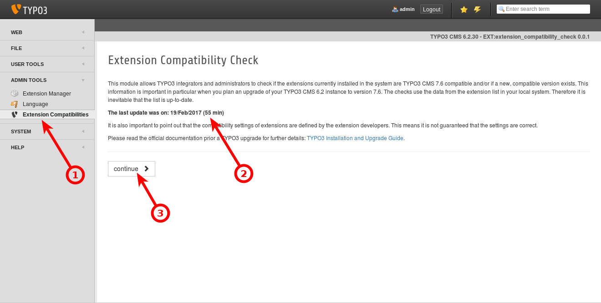
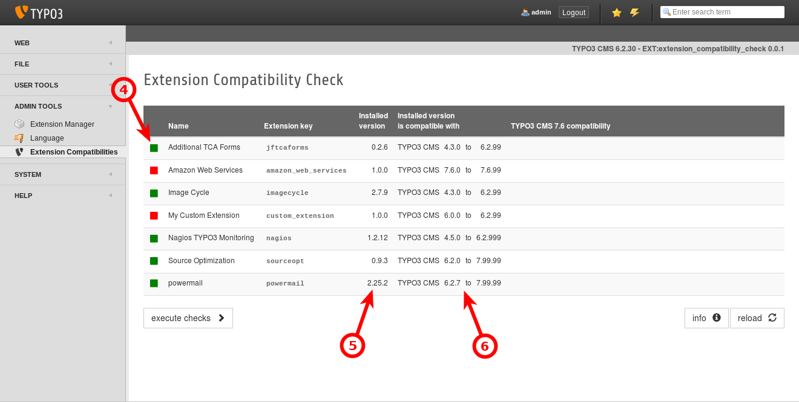
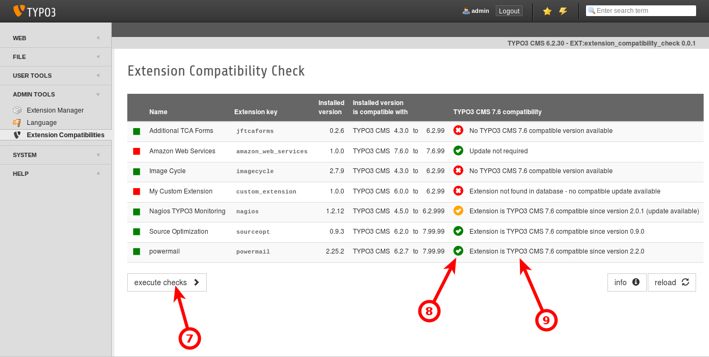

.. =============================================================================
.. Extension Compatibility Check
.. (c)2017 Michael Schams <schams.net>
.. https://schams.net
.. =============================================================================

.. include:: ../Includes.txt

Screenshots
===========

*Screenshot above:*
Once the extension has been installed via the Extension Manager, you can access the backend module **Extension Compatibilities** in section "ADMIN TOOLS" **(1)**.
The first page provides some basic information about the extension and shows the date of the last extension list update **(2)**.
Make sure the extension list is up-to-date (go to the Extension Manager to update the list as required).
Click button "continue" **(3)** to proceed to the next step.

*Screenshot above:*
A list of all currently installed extension is shown on the second page. The red or green square **(4)** left-hand-side indicates if an extension is install and activated (*green*) or just installed, but currently not activated (*red*). The column marked **(5)** shows the currently installed version in the system. The column marked **(6)** shows with which versions of TYPO3 CMS the currently installed extension version is compatible (see section ":ref:`system-requirements`" for further details).

*Screenshot above:*
Once the checks are executed by clicking button "execute checks" **(7)**, the table gets filled with some more details as shown in the third screenshot. The icons **(8)** provide you with a quick overview of the status (the more green icons, the better). The suggestions right-hand-side **(9)** provide further details about possible actions.

Please read section ":ref:`results-and-actions`" for further details.
