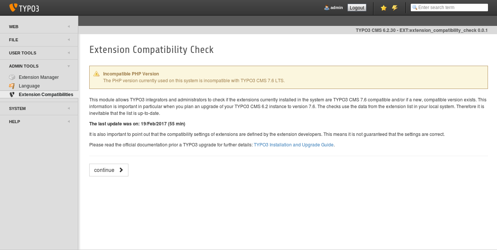
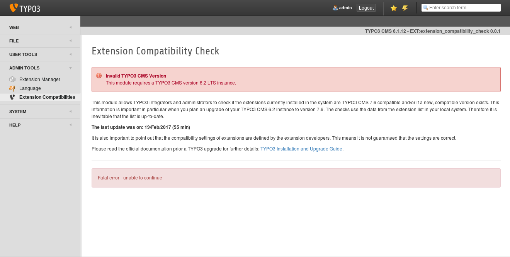

.. =============================================================================
.. Extension Compatibility Check
.. (c)2017 Michael Schams <schams.net>
.. https://schams.net
.. =============================================================================

.. include:: ../Includes.txt

Secondary Checks
================

On the first page, some basic (*secondary*) checks are conducted. The following screenshots and explanations describe these.

Screenshots
^^^^^^^^^^^

*Screenshot above:*
TYPO3 CMS version 7.6 requires at least PHP version 5.5. If the current TYPO3 CMS instance runs on a system, which uses a PHP version which is incompatible with 7.6 (for example PHP version 5.4), a warning message as shown. However, you can proceed to the next step anyway, because you can run the checks on a different server than the system you are planning to do the TYPO3 CMS upgrade on. If you see this warning, please note that the *current* PHP version is incompatible with TYPO3 CMS 7.6.

*Screenshot above:*
If you run this extension on a TYPO3 CMS instance, which is not TYPO3 version 6.2 LTS, the error message shown in the screenshot appears. Due to the fact that this extension requires TYPO3 CMS 6.2, you can not proceed to the next step in this case.
